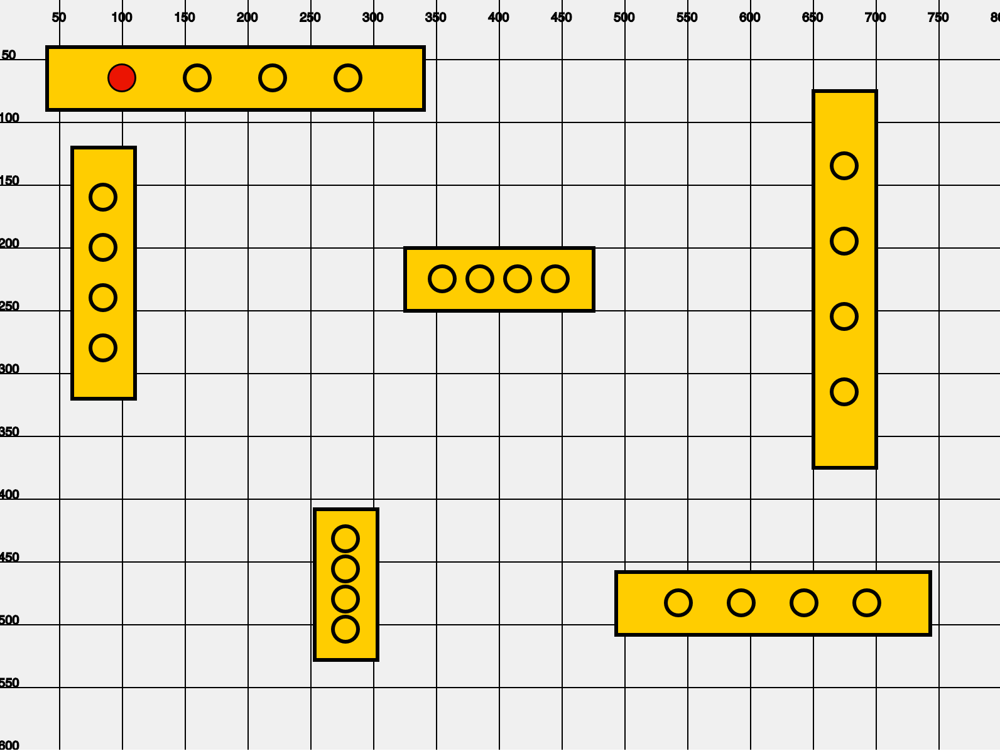

# P5 Battleship!

## Introduction


A-6? Miss. B-9? Miss. P-5? HIT! YOU SUNK MY BATTLESHIP!

## Description

In this lab, you'll be practicing using the canvas coordinate system in p5 by placing round 'pegs' on the canvas as if you were playing Battleship. Your goal is to place the red pegs directly on the black holes in the battleships on the board.

To get started, fork and clone this lab and open it up in Sublime Text. Open up index.html in your Browser.

You'll be writing your peg guesses in the 'your-guess.js' file, inside the function called `placePins`. We've solved the first peg for you, see if you can add the rest!

```javascript
  ellipse(100, 65, 20, 20); //This is the first solved pin!
```

## Extensions!

+ See if you can figure out how to move the ships around and add new ships
+ Can you have each ship be a different color?
+ What if each of the pin-holes were a different shape?
+ What if the ships were moving?!?

## Resources

Include links to any additional resources here.